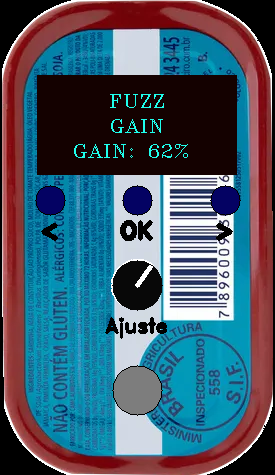
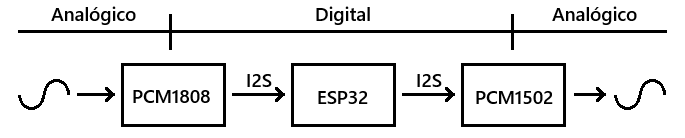

# Pedal Digital com Seleção de Efeito

Este projeto tem como objetivo desenvolver um pedal digital de baixo custo para guitarra altamente configurável, com vários efeitos disponíveis para serem utilizados.

- [Protótipo digital](https://github.com/Rafael-Marinho-dos-Anjos/smart_pedal/tree/prototipo)

### Principais componentes

| Componente | Descrição | Função |
|------------|-----------|--------|
| ESP32 | Microcontrolador | Realizar todo o processamento de áudio e interação com componentes de entrada/saída de comandos do usuário |
| PCM1808 | ADC de 24 bits | Converte o sinal de entrada analógico para digital |
| PCM1502 | DAC de 24 bits | Converte o sinal de áudio digital processado de volta para analógico |

### Comunicação entre os componentes

Todo o processamento de áudio é feito em 3 etapas: leitura de entrada (PCM1808), aplicação de efeitos (ESP32) e escrita da saída (PCM1502).

Cada etapa possui um dispositivo responsável por executar a sua ação e enviar o sinal de áudio para o dispositivo seguite. Este envio de informações é feito via protocolo I2S.

